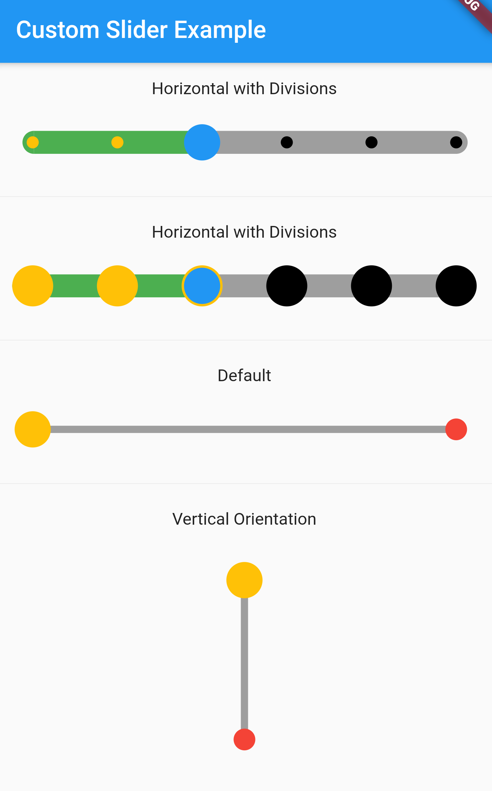

# flutter_Custom_slider

A Flutter Custom Slider.
https://pub.dev/packages/flutter_custom_slider

# Creating Custom Slide

             CustomSlider(
                          activeTrackColor:Colors.green,
                          activeTickMarkColor:Colors.amber,
                          activeThumpColor:Colors.blue,
                          inactiveTrackColor: Colors.grey,
                          inactiveTickMarkColor:Colors.black,
                          thumpRadius: 15,
                          tickMarkRadius: 5,
                          trackHeight: 19,
                          onChanged: (value) {
                            // Do something
                          },
                          value: 3,
                          divisions: 5,
                          marginTrackShape: 30,
                        )

            
## Screenshots

